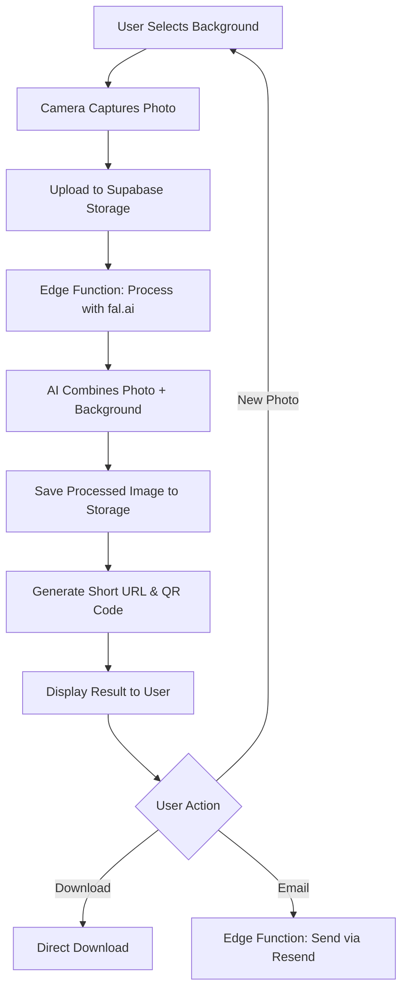

# Photo Booth AI - Complete Implementation Plan

## Current Status
✅ Frontend UI complete (background selector, camera capture, result display)  
✅ iPad-optimized responsive design  
✅ fal.ai API key ready  
❌ No backend integration yet  
❌ No database setup  
❌ No image storage  
❌ No AI processing

## Architecture Overview



## What You Need to Set Up

### 1. **Lovable Cloud** (Replaces PostgreSQL + S3)
**Good news**: You don't need to set up PostgreSQL or AWS S3 separately! Lovable Cloud includes:
- ✅ PostgreSQL database (via Supabase)
- ✅ File storage buckets (like S3)
- ✅ Edge functions (serverless backend)
- ✅ Secrets management for API keys

**Why this is better**: Everything is integrated, auto-deployed, and managed in one place.

---

## Step-by-Step Implementation Plan

### **PHASE 1: Backend Setup** (5 minutes)

#### Step 1.1: Enable Lovable Cloud
- Click on **Cloud** button in top navigation
- Enable Lovable Cloud (free tier available)
- Wait for deployment to complete

#### Step 1.2: Add Secrets
Add two secrets:
- `FAL_KEY`: Your fal.ai API key (for AI image processing)
- `RESEND_API_KEY`: For email delivery (you'll need to sign up at resend.com)

#### Step 1.3: Create Database Tables
Run SQL migrations to create:

**Table 1: `processed_photos`**
```sql
create table public.processed_photos (
  id uuid primary key default gen_random_uuid(),
  user_session_id text,
  original_image_url text,
  processed_image_url text,
  background_id text,
  share_code text unique,
  created_at timestamp with time zone default now()
);

-- Enable RLS
alter table public.processed_photos enable row level security;

-- Allow public read access to processed photos
create policy "Public can view processed photos"
  on public.processed_photos
  for select
  to public
  using (true);

-- Allow authenticated users to insert
create policy "Authenticated users can create photos"
  on public.processed_photos
  for insert
  to authenticated
  with check (true);
```

**Table 2: `email_deliveries`** (optional, for tracking)
```sql
create table public.email_deliveries (
  id uuid primary key default gen_random_uuid(),
  photo_id uuid references public.processed_photos(id) on delete cascade,
  email_address text not null,
  sent_at timestamp with time zone default now(),
  delivery_status text default 'sent'
);

-- Enable RLS
alter table public.email_deliveries enable row level security;

-- Only allow authenticated users to insert
create policy "Authenticated users can log email deliveries"
  on public.email_deliveries
  for insert
  to authenticated
  with check (true);
```

#### Step 1.4: Create Storage Buckets
Create two public storage buckets:

```sql
-- Create buckets
insert into storage.buckets (id, name, public)
values 
  ('photo-originals', 'photo-originals', true),
  ('photo-processed', 'photo-processed', true);

-- Allow public access to read files
create policy "Public can view original photos"
  on storage.objects for select
  to public
  using (bucket_id = 'photo-originals');

create policy "Public can view processed photos"
  on storage.objects for select
  to public
  using (bucket_id = 'photo-processed');

-- Allow authenticated users to upload
create policy "Authenticated users can upload originals"
  on storage.objects for insert
  to authenticated
  with check (bucket_id = 'photo-originals');

create policy "Authenticated users can upload processed"
  on storage.objects for insert
  to authenticated
  with check (bucket_id = 'photo-processed');
```

---

### **PHASE 2: Edge Functions** (Backend Logic)

#### Function 1: `process-photo`
**Purpose**: Takes captured photo + background prompt → calls fal.ai → returns processed image

**Input**:
```typescript
{
  imageBase64: string,      // captured photo
  backgroundPrompt: string, // from backgrounds array
  backgroundId: string      // jungle, ocean, etc.
}
```

**Process**:
1. Upload original image to `photo-originals` bucket
2. Call fal.ai API with prompt:
   - Model: `fal-ai/flux/dev` or similar background replacement model
   - Input: original image + background prompt
3. Download processed image from fal.ai
4. Upload to `photo-processed` bucket
5. Generate unique `share_code` (6-character alphanumeric)
6. Save record to `processed_photos` table
7. Return processed image URL + share code

**Output**:
```typescript
{
  processedImageUrl: string,
  shareCode: string,
  shareUrl: string  // e.g., yourdomain.com/share/ABC123
}
```

**File**: `supabase/functions/process-photo/index.ts`

#### Function 2: `send-photo-email`
**Purpose**: Sends processed photo via email using Resend

**Input**:
```typescript
{
  email: string,
  photoId: string,
  imageUrl: string
}
```

**Process**:
1. Validate email format
2. Send email with Resend API including:
   - Siemens Healthineers branding
   - Embedded photo
   - Download link
3. Log to `email_deliveries` table

**File**: `supabase/functions/send-photo-email/index.ts`

#### Function 3: `get-shared-photo` (optional)
**Purpose**: Retrieve photo by share code for QR code scanning

**Input**: `shareCode` from URL parameter

**Output**: Redirects to photo or shows download page

**File**: `supabase/functions/get-shared-photo/index.ts`

---

### **PHASE 3: Frontend Integration**

#### Update 1: `src/pages/Index.tsx`
Replace the `handlePhotoCapture` TODO with actual API call:

```typescript
const handlePhotoCapture = async (imageData: string) => {
  setCapturedPhoto(imageData);
  setState("processing");
  
  try {
    const { data, error } = await supabase.functions.invoke('process-photo', {
      body: {
        imageBase64: imageData,
        backgroundPrompt: selectedBackground.prompt,
        backgroundId: selectedBackground.id
      }
    });
    
    if (error) throw error;
    
    setProcessedPhoto(data.processedImageUrl);
    setShareUrl(data.shareUrl); // store for QR code
    setState("result");
  } catch (error) {
    toast.error("Failed to process photo. Please try again.");
    setState("selecting");
  }
};
```

#### Update 2: `src/components/ResultDisplay.tsx`
- Use actual `shareUrl` prop instead of placeholder
- Connect email button to `send-photo-email` function
- Add proper error handling

---

### **PHASE 4: Email Setup** (External)

You'll need to:
1. Sign up at [resend.com](https://resend.com) (free tier: 100 emails/day)
2. Verify your domain (or use their test domain `onboarding@resend.dev`)
3. Create API key at: https://resend.com/api-keys
4. Validate your domain at: https://resend.com/domains
5. Provide API key to add as `RESEND_API_KEY` secret

---

### **PHASE 5: Testing Checklist**

- [ ] Select background → prompt appears
- [ ] Capture photo → uploads to storage
- [ ] AI processing → fal.ai returns edited image
- [ ] Processed image displays with branding
- [ ] QR code scans → opens shareable link
- [ ] Download button → downloads image
- [ ] Email input → sends photo via Resend
- [ ] Test on iPad in portrait mode
- [ ] Test multiple camera switching

---

## File Structure After Implementation

```
supabase/
├── config.toml
├── functions/
│   ├── process-photo/
│   │   └── index.ts
│   ├── send-photo-email/
│   │   └── index.ts
│   └── get-shared-photo/
│       └── index.ts
└── migrations/
    ├── 20240101000001_create_processed_photos.sql
    ├── 20240101000002_create_email_deliveries.sql
    └── 20240101000003_create_storage_buckets.sql

src/
├── integrations/supabase/  (auto-generated)
└── pages/Index.tsx (updated)
```

---

## Cost Estimate (Monthly)

**Lovable Cloud**: Free tier includes:
- Database: PostgreSQL with 500MB storage
- Storage: 1GB file storage
- Edge Functions: 500K invocations

**fal.ai**: ~$0.05 per image generation (you'll need to add credits)

**Resend**: Free tier = 100 emails/day

**For an event**: Estimate 100 photos = ~$5 in AI costs

---

## FAL.ai Model Recommendations

For background replacement, use one of these models:

### Option 1: fal.ai Models (Paid)
- **Model**: `fal-ai/flux/dev` - Best quality for background replacement
- **Alternative**: `fal-ai/recraft-v3` - Faster, slightly lower quality
- **Cost**: ~$0.05 per image

### Option 2: Lovable AI Gateway (FREE until Oct 13, 2025)
- **Model**: `google/gemini-2.5-flash-image-preview`
- **Cost**: FREE during promotional period
- **Benefit**: No need for fal.ai API key, uses Lovable's built-in AI gateway

**Recommendation**: Start with Lovable AI Gateway (Gemini) since it's free during the promo period!

---

## API Keys Needed

1. **FAL_KEY** (if using fal.ai)
   - Sign up at: https://fal.ai
   - Get API key from dashboard
   - Your key: `ed5babff-97f0-4af5-9ff7-6fb1be23358c:879ef6b4e55e7fd8e4d0c68b491867e6`

2. **RESEND_API_KEY** (for email)
   - Sign up at: https://resend.com
   - Create API key
   - Verify domain or use test domain

---

## Next Steps Summary

1. ✅ Review this plan
2. Enable Lovable Cloud from top navigation
3. Add `FAL_KEY` secret in Cloud → Secrets
4. Create database tables using SQL above
5. Create storage buckets using SQL above
6. Implement the 3 edge functions
7. Update frontend to call edge functions
8. Sign up for Resend and add `RESEND_API_KEY`
9. Integrate email functionality
10. Test the complete flow
11. 🎉 App is production-ready!

---

## Support Resources

- **Lovable Cloud Docs**: https://docs.lovable.dev/features/cloud
- **Lovable AI Docs**: https://docs.lovable.dev/features/ai
- **fal.ai Docs**: https://fal.ai/docs
- **Resend Docs**: https://resend.com/docs
- **Supabase Storage**: https://supabase.com/docs/guides/storage

---

## Security Considerations

1. **RLS Policies**: All tables have Row Level Security enabled
2. **Public Access**: Only processed photos are publicly accessible via share codes
3. **API Keys**: All secrets stored securely in Lovable Cloud
4. **CORS**: Edge functions configured with proper CORS headers
5. **Email Validation**: Email addresses validated before sending
6. **Storage**: Buckets configured with appropriate public/private access
