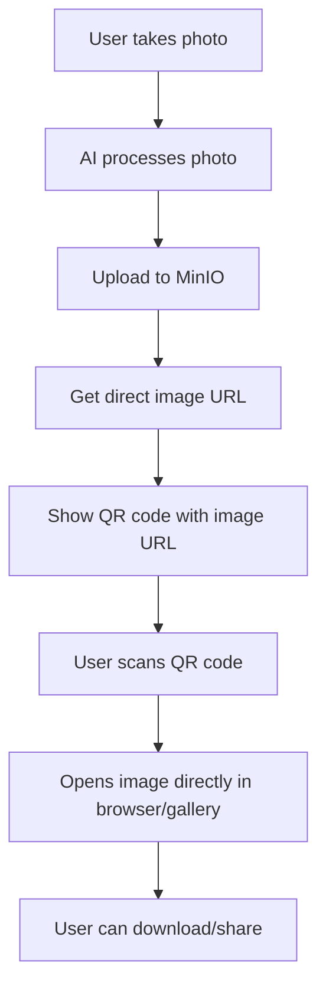

# Photo Sharing System

## Overview

The photo booth includes a robust sharing system that allows users to generate QR codes and share links to their processed photos.

## How It Works

### 1. **Photo Processing & Storage**

When a user takes a photo:
1. The photo is processed with AI (background replacement + branding)
2. A unique 6-character share code is generated (e.g., `PWE1VA`)
3. The photo is saved to:
   - **Primary**: PostgreSQL (metadata) + MinIO (image files)
   - **Fallback**: Browser localStorage (if cloud fails)

### 2. **Direct Image Sharing**

The QR code now points **directly to the image file** on MinIO, not to an intermediate page:

```
https://storage.akitapr.com/photobooth/photo_1761681865008_u11c1b6_processed.jpg
```

**Benefits:**
- ✅ Works immediately after upload (no share page needed)
- ✅ Opens directly in browser/gallery
- ✅ Can be downloaded with right-click
- ✅ No database lookup required
- ✅ Simpler and more reliable

### 3. **QR Code Display**

After processing, users see:
- Their processed photo with Akitá branding
- A QR code that links **directly to the image URL**
- Options to:
  - Download the photo
  - Copy the image link
  - Send via email (coming soon)
  - Take another photo

### 4. **Viewing Shared Photos**

When someone scans the QR code:
1. Opens the **direct MinIO image URL** (e.g., `https://storage.akitapr.com/photobooth/photo_xxx_processed.jpg`)
2. Image opens in browser or gallery app
3. Can be downloaded, shared, or saved directly
4. No intermediate page or database lookup needed

**For base64/localStorage fallback:**
- If cloud storage fails, QR code contains the base64 data URI
- Opens the image directly in browser

## Technical Implementation

### Routes

```typescript
// App.tsx
<Routes>
  {/* Share page - no sidebar, clean display */}
  <Route path="/share/:shareCode" element={<SharePage />} />
  
  {/* Main app routes with sidebar */}
  <Route path="/*" element={<MainAppWithSidebar />} />
</Routes>
```

### Components

#### `SharePage.tsx`
- Loads photo by share code
- Displays loading state
- Shows error if photo not found
- Clean, branded display without sidebar
- Download functionality

#### `ResultDisplay.tsx`
- Shows processed photo after capture
- Generates QR code with share URL
- Provides sharing options
- "Take Another" button to restart flow

### Storage Service

#### `localStorage.ts`
```typescript
// Generate share URL
export function getShareUrl(shareCode: string): string {
  const baseUrl = import.meta.env.VITE_BASE_URL || 'https://photo.akitapr.com';
  return `${baseUrl}/share/${shareCode}`;
}

// Fetch photo by share code (cloud first, localStorage fallback)
export async function getPhotoByShareCode(shareCode: string): Promise<ProcessedPhoto | null>
```

#### `cloudStorage.ts`
```typescript
// Fetch photo metadata from backend
export async function getPhotoByShareCode(shareCode: string): Promise<CloudPhoto | null>
```

## Environment Variables

Set in `.env`:
```bash
# Base URL for share links (production)
VITE_BASE_URL=https://photo.akitapr.com

# Backend API (for cloud storage)
VITE_API_URL=http://localhost:3001
```

## Backend API

### Get Photo by Share Code
```http
GET /api/photos/:shareCode
```

**Response:**
```json
{
  "id": "photo_1761681865008_u11c1b6",
  "shareCode": "PWE1VA",
  "originalImageUrl": "https://storage.akitapr.com/photobooth/photo_..._original.jpg",
  "processedImageUrl": "https://storage.akitapr.com/photobooth/photo_..._processed.jpg",
  "backgroundId": "glares",
  "backgroundName": "Particle Field",
  "createdAt": 1761681865008,
  "prompt": "..."
}
```

## Deployment

### Domain Setup

1. **Main App**: `photo.akitapr.com`
   - Serves the React app (Nginx)
   - Handles all routes including `/share/:shareCode`

2. **Storage**: `storage.akitapr.com`
   - MinIO server for image files
   - Publicly accessible URLs for image download

3. **Backend API**: `photo.akitapr.com/api/*`
   - Proxied to Express backend (port 3001)
   - Handles PostgreSQL + MinIO operations

### Nginx Configuration

```nginx
server {
    listen 80;
    server_name photo.akitapr.com;
    
    # Frontend (React SPA)
    location / {
        root /usr/share/nginx/html;
        try_files $uri $uri/ /index.html;
    }
    
    # Backend API
    location /api/ {
        proxy_pass http://backend:3001;
        proxy_http_version 1.1;
        proxy_set_header Upgrade $http_upgrade;
        proxy_set_header Connection 'upgrade';
        proxy_set_header Host $host;
        proxy_cache_bypass $http_upgrade;
    }
}
```

## User Flow



## Troubleshooting

### QR Code shows image not found / 403 error
**Causa**: MinIO bucket doesn't have public read permissions

**Solución**:
```bash
npm run setup-minio
```

This sets the bucket policy to allow public read access.

### QR Code doesn't open anything
**Causa**: Image wasn't uploaded to MinIO or URL is incorrect

**Solución**:
1. Check backend logs for upload errors
2. Verify MinIO credentials in `.env`
3. Test MinIO connection: `curl https://storage.akitapr.com/photobooth/`
4. Check that photo was saved: look for success message in backend logs

### Image loads but is corrupted
**Causa**: Upload failed or image buffer corrupted

**Solución**:
1. Check backend logs during upload
2. Verify image is valid before upload
3. Test with a smaller image
4. Check MinIO storage capacity

### QR code contains base64 instead of URL
**Causa**: Cloud storage failed, fell back to localStorage

**Why it happens**:
- Backend not running
- PostgreSQL connection failed
- MinIO upload failed

**Solución**:
1. Run `npm run dev:full` to start both frontend and backend
2. Check `.env` has correct credentials
3. Verify PostgreSQL and MinIO are accessible

## Future Enhancements

- [ ] Email sharing integration
- [ ] Social media sharing (Twitter, Facebook)
- [ ] Photo expiration (auto-delete after X days)
- [ ] Photo gallery view
- [ ] Analytics (view count, download count)
